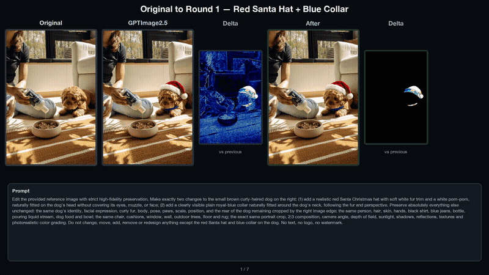

# Pixel-Level Image Editing

**Model-agnostic, pixel-preserving image editing for single edits and multi-round workflows.**

Generative image editors often modify much more than the requested object. A small edit can quietly change skin, fabric, walls, lighting, texture, perspective, or background details. These changes accumulate across multiple rounds.

This workflow keeps the requested edit while restoring every pixel outside the accepted edit mask from the baseline image. The image generator is replaceable: GPT Image, FLUX, Gemini, Stable Diffusion, or any other editor can provide the edited image.

## Demo

[](assets/demo.mp4)

**[Watch or download the full 1080p comparison video](assets/demo.mp4)**

The demo shows:

- a fixed **Original** reference;
- raw multi-round generations;
- pixel-preserved outputs;
- before/after difference heatmaps;
- two enlarged detail regions across seven consecutive rounds.

## What it does

```text
Before image + After image
          |
          v
   edit mask extraction  <---- optional SAM 3.1 binary mask
          |
          v
keep edited pixels inside the mask
restore baseline pixels outside the mask
          |
          v
result + mask + difference heatmaps + validation report
```

For multi-round editing, accepted masks are accumulated. Each new round starts from the original canvas, restores all previously accepted edit regions, and then applies the current edit according to an explicit overlap policy.

## Key features

- **Two-image quick start** — upload or pass a Before/After pair.
- **Exact outside-mask invariant** — pixels outside the final mask are byte-identical to the baseline image.
- **Multi-round accumulation** — keep earlier accepted edits while adding later ones.
- **Conflict handling** — choose whether the current or previous edit wins in overlapping regions.
- **Geometry-preserving recolor** — transfer color while retaining the previous object's geometry and luminance texture.
- **SAM 3.1 compatible** — use a binary mask exported by SAM 3.1 or another segmentation system.
- **Automatic mask fallback** — a zero-setup image-difference backend is included for aligned pairs.
- **Auditable outputs** — masks, heatmaps, per-round metrics, manifests, and exact-pixel validation.
- **Model agnostic** — the upstream image-generation model can be changed without changing this workflow.

## Installation

```bash
git clone https://github.com/gavin-sparkols/像素级图片编辑.git
cd 像素级图片编辑
python -m venv .venv
source .venv/bin/activate
pip install -e .
```

## Quick start: Before + After

Only two images are required for the zero-setup workflow:

```bash
pixel-edit pair \
  --before path/to/before.png \
  --after path/to/after.png \
  --output runs/example
```

Outputs:

```text
runs/example/
├── result.png
├── mask.png
├── heatmap_before.png
├── heatmap_after.png
└── report.json
```

### Use a SAM 3.1 mask

Automatic difference masks are convenient, but generative images with heavy global drift benefit from a reviewed segmentation mask:

```bash
pixel-edit pair \
  --before path/to/before.png \
  --after path/to/after.png \
  --mask path/to/sam31_mask.png \
  --output runs/sam-mask
```

The mask must be a binary image. White pixels are accepted edit regions; black pixels are restored from the Before image.

### Recolor without replacing texture

Use recolor mode when the requested change is primarily a color change:

```bash
pixel-edit pair \
  --before path/to/before.png \
  --after path/to/after.png \
  --mask path/to/object_mask.png \
  --mode recolor \
  --output runs/recolor
```

Instead of copying the generated object's shape and texture, this mode transfers hue, saturation, and relative brightness onto the previous pixels.

## Local web interface

```bash
pip install -e '.[app]'
pixel-edit app
```

Open `http://127.0.0.1:7860`, upload the Before and After images, and select **Process**. A SAM mask can be uploaded when available.

## Multi-round workflow

Create a JSON config based on [`examples/sequence.json`](examples/sequence.json):

```json
{
  "original": "original.png",
  "rounds": [
    {
      "name": "add-object",
      "image": "round_01.png",
      "mask": "mask_01.png",
      "mode": "paste",
      "overlap": "current"
    },
    {
      "name": "recolor-background-object",
      "image": "round_02.png",
      "mask": "mask_02.png",
      "mode": "recolor",
      "overlap": "previous"
    }
  ]
}
```

Run it:

```bash
pixel-edit sequence \
  --config examples/sequence.json \
  --output runs/sequence
```

### Edit modes

| Mode | Behavior | Recommended use |
|---|---|---|
| `paste` | Copies target pixels inside the current mask | Add, remove, replace, reshape |
| `recolor` | Transfers color onto previous pixels | Recolor while preserving geometry and texture |

### Overlap policies

| Policy | Behavior | Recommended use |
|---|---|---|
| `current` | The current round wins overlapping pixels | A new foreground object or intentional replacement |
| `previous` | Earlier edits stay above the current round | A background recolor behind an existing foreground object |

## Automatic-mask tuning

```bash
pixel-edit pair \
  --before before.png \
  --after after.png \
  --threshold 24 \
  --min-area-ratio 0.0005 \
  --dilate 5 \
  --output runs/tuned
```

- Increase `--threshold` when global model drift is entering the mask.
- Increase `--min-area-ratio` to remove small isolated regions.
- Increase `--dilate` when the mask misses edit boundaries.
- For final production output, inspect the generated mask or provide a reviewed SAM 3.1 mask.

## Validation guarantee

Every output report contains:

```json
{
  "outside_mask_pixel_mismatches": 0,
  "status": "PASS"
}
```

`PASS` means every pixel outside the accepted mask is exactly equal to the baseline image on the normalized canvas.

## Run tests

```bash
pip install -e '.[dev]'
pytest -q
```

## Project structure

```text
.
├── assets/                     # Full demo video and preview
├── examples/                   # Multi-round JSON example
├── src/pixel_level_editing/
│   ├── app.py                     # Gradio interface
│   ├── cli.py                     # Command-line interface
│   └── core.py                    # Masks, compositing, recolor, QA
├── tests/
├── pyproject.toml
└── README.md
```

## License

[MIT](LICENSE)

